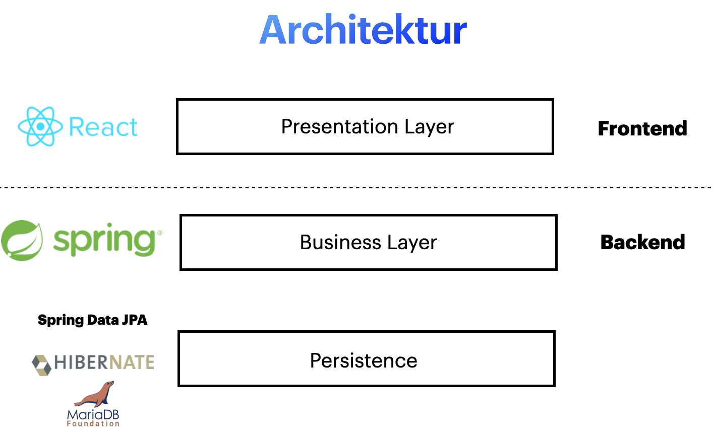

# Single-Page-Application made with Springboot

### Docker
Create Image:
`docker build -t springio/gs-spring-boot-docker .`

Start Container:
`docker run -p 8080:8080 --network springbootbackend_default springio/gs-spring-boot-docker`

### Databaseinformations

Pull Dockerimage: 

`docker pull mariadb`

Start Container: 

`docker run --name mariadb -v /home/localadmin/electrolernappDatabase/:/var/lib/mysql --network springbootbackend_default -e MYSQL_ROOT_PASSWORD=electrolernapp2020 -d mariadb:10`
